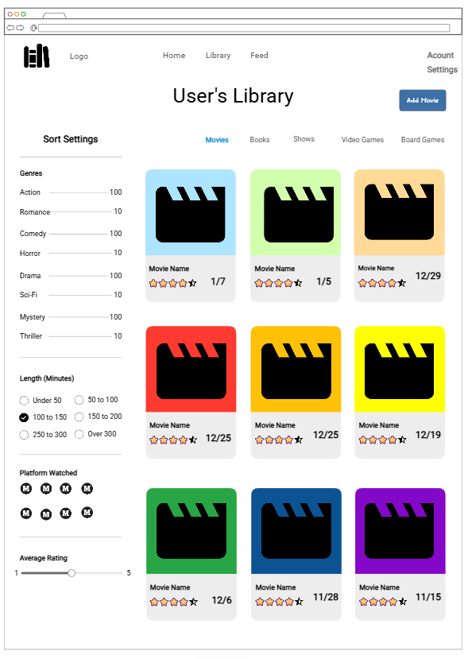

# CheckOff

[My Notes](notes.md)

**CheckOff** is a media tracker website, allowing you to track and record all forms of media that you have consumed, such as movies, books, shows, and video games, all in one convenient place.

## 🚀 Specification Deliverable

For this deliverable I did the following. I checked the box `[x]` and added a description for things I completed.

- [x] Proper use of Markdown
- [x] A concise and compelling elevator pitch
- [x] Description of key features
- [x] Description of how you will use each technology
- [x] One or more rough sketches of your application. Images must be embedded in this file using Markdown image references.

### Elevator pitch

Your taste in books, movies, and games defines who you are. Yet, there is no single website to track it all; instead one website for books, another for movies, others for games. **CheckOff** solves all of this by unifying your media life. It is a comprehensive tracking dashboard that allows users to search, rate, and log movies, books, and all types of games in one centralized location. **CheckOff** also introduces a social layer, allowing users to see a live feed of what their friends are currently finishing or rating. Stop toggling between three different apps; track your entire digital life in one place!

### Design
Here are examples of what the login page will look like, as well as the main library page after logging in.

### Key features

- User login with secure connection over HTTPS
- Ability to search for different media, such as books, movies, video games, board games, using various APIs
- Add media to their library, marked as seen/read/played with the applicable date, or want to see/read/play.
- Rate media and leave a review.
- See live updates from other users on their media library changes and reviews.

### Technologies

I am going to use the required technologies in the following ways.

- **HTML** - HTML will provide the basic website structure, with pages for login, public feed, and your library.
- **CSS** - Styling for website that is clean and easily readable. Light and dark mode options. Usable on computer and phone.
- **React** - Provides a login landing page form, public update feed flow, displaying user's library, and showing search/add media interface.
- **Service** - Backend service that allows for:
    - logging in
    - retrieving user media input
    - searching for that media in the correct database API 
- **DB/Login** - Stores user/login info, each user's library using data from the APIs, each library tied to their specific login information.
- **WebSocket** - After a user updates or changes something in their library, this change gets broadcasted to every other user.

## 🚀 AWS deliverable

For this deliverable I did the following. I checked the box `[x]` and added a description for things I completed.

- [x] **Server deployed and accessible with custom domain name** - [My server link](https://yourdomainnamehere.click).

## 🚀 HTML deliverable

For this deliverable I did the following. I checked the box `[x]` and added a description for things I completed.

- [x] **HTML pages** - I added HTML for each seperate page I will have on the completed webpage.
- [X] **Proper HTML element usage** - I used a variety of HTML elements such as div, nav, main, img. Each for their own role.
- [X] **Links** - I included links connecting each different webpage. I also included links that will modify one html page further on in the webpage development.
- [x] **Text** - I included all the necessary text to explain the website to the user and allow them to navigate.
- [X] **3rd party API placeholder** - I filled in movie details such as genre and year, and included a plcaeholder movie poster, all of which will be replaced by the API.
- [x] **Images** - I included a logo image for the website, on the webpage and in the tab. I also included placeholder images for movie posters and user profile images.
- [x] **Login placeholder** - On the main library page I included a spot where the user's username will be displayed.
- [X] **DB data placeholder** - I included an account settings page where the user's account details stored in the DB can be seen an edited. Additionally, the user's library info will be stored in the DB
- [x] **WebSocket placeholder** - I added examples of user updates on the FEED page, which will be replaced with live updates from other users.

## 🚀 CSS deliverable

For this deliverable I did the following. I checked the box `[x]` and added a description for things I completed.

- [x] **Visually appealing colors and layout. No overflowing elements.** - I stuck with a simple white/gray color scheme. Most elements were given rounded corners and some were given shadows for visual appeal.
- [x] **Use of a CSS framework** - I used Bootstrap for the ADD MOVIE button on library.html.
- [x] **All visual elements styled using CSS** - CSS was used.
- [x] **Responsive to window resizing using flexbox and/or grid display** - Both grid and flex were used in various parts of the site. Elements such as boxes and texts scale to the window, with spacing between elements also scaling.
- [x] **Use of a imported font** - I used a font from Google - Roboto.
- [x] **Use of different types of selectors including element, class, ID, and pseudo selectors** - I used an assortment of selectors and combination of them in order to apply CSS.

## 🚀 React part 1: Routing deliverable

For this deliverable I did the following. I checked the box `[x]` and added a description for things I completed.

- [ ] **Bundled using Vite** - I did not complete this part of the deliverable.
- [ ] **Components** - I did not complete this part of the deliverable.
- [ ] **Router** - I did not complete this part of the deliverable.

## 🚀 React part 2: Reactivity deliverable

For this deliverable I did the following. I checked the box `[x]` and added a description for things I completed.

- [ ] **All functionality implemented or mocked out** - I did not complete this part of the deliverable.
- [ ] **Hooks** - I did not complete this part of the deliverable.

## 🚀 Service deliverable

For this deliverable I did the following. I checked the box `[x]` and added a description for things I completed.

- [ ] **Node.js/Express HTTP service** - I did not complete this part of the deliverable.
- [ ] **Static middleware for frontend** - I did not complete this part of the deliverable.
- [ ] **Calls to third party endpoints** - I did not complete this part of the deliverable.
- [ ] **Backend service endpoints** - I did not complete this part of the deliverable.
- [ ] **Frontend calls service endpoints** - I did not complete this part of the deliverable.
- [ ] **Supports registration, login, logout, and restricted endpoint** - I did not complete this part of the deliverable.

## 🚀 DB deliverable

For this deliverable I did the following. I checked the box `[x]` and added a description for things I completed.

- [ ] **Stores data in MongoDB** - I did not complete this part of the deliverable.
- [ ] **Stores credentials in MongoDB** - I did not complete this part of the deliverable.

## 🚀 WebSocket deliverable

For this deliverable I did the following. I checked the box `[x]` and added a description for things I completed.

- [ ] **Backend listens for WebSocket connection** - I did not complete this part of the deliverable.
- [ ] **Frontend makes WebSocket connection** - I did not complete this part of the deliverable.
- [ ] **Data sent over WebSocket connection** - I did not complete this part of the deliverable.
- [ ] **WebSocket data displayed** - I did not complete this part of the deliverable.
- [ ] **Application is fully functional** - I did not complete this part of the deliverable.
